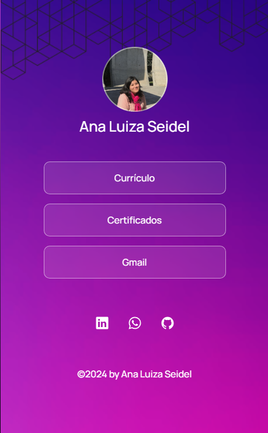

    

    Projeto desenvolvido durante curso de formação em front-end.

## 👩‍💻 Tecnologias utilizadas 
⤷ HTML e CSS 
⤷ JavaScript 
⤷ Git e GitHub

## 🖥️ Projeto
⤷ Agregador de links para usar usar como cartão de visitas online.

    
    

    ©2024 by Ana Luiza Seidel

